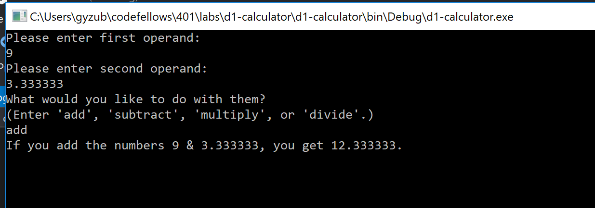
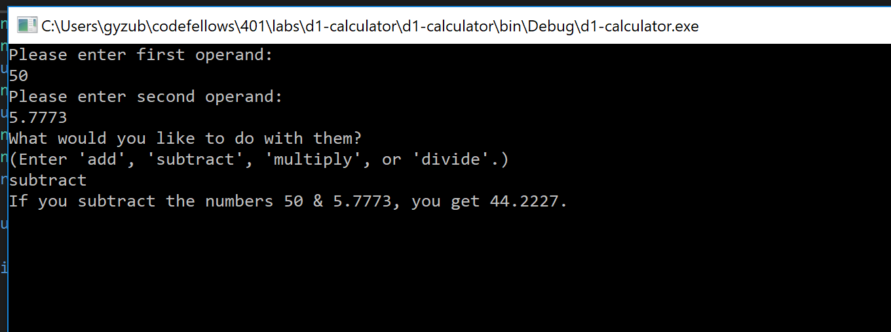
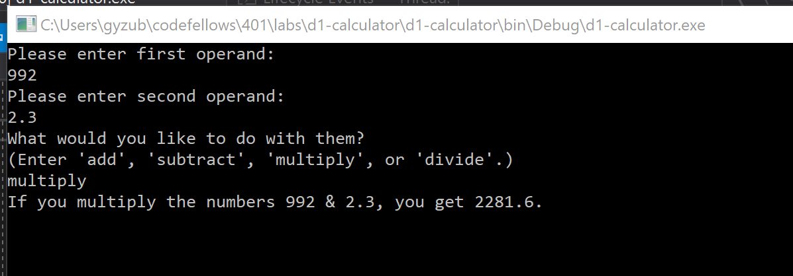
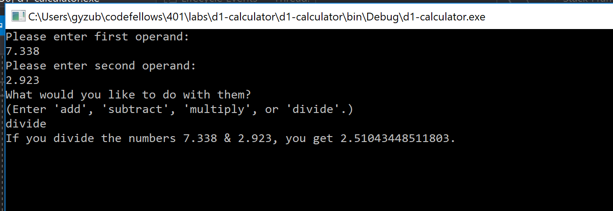

# d1-calculator

# REQUIREMENTS:
Create a Calculator. Use everything that you have learned from the prework tutorials.

Create a very basic, 4 function calculator within a console application.

Specs
Upon completion, your calculator should contain the following:

Inside the Program.cs file of your console application you should have 4 external methods plus the Main method:
Add()
Subtract()
Multiply()
Divide()
Each of these methods should take in 2 parameters, and return the solution of those 2 numbers. (i.e if you are adding 2 numbers than your return would be the sum of the 2 numbers added together. )

Output to the console the answer to the proposed math problem.

# ARCHITECTURE:
Main
 - keeps 'Manager' running until user exits
Manager
  - collects desired operation from user, routes for validation, and stores as string
  - collects operands from user, routes them to input validation function, stores returns as doubles
  - routes operands to correct operation function (via switch)
  - displays results to user on console
  - exits program after single run
  
ValidateNum, ValidateOperation
  - validates user inputs
  - prompts for corrections when appropriate
  - returns validate inputs

Add, Subtract, Multiply, Divide
  - accepts 2 operands (type: double) and returns the sum, difference, product, or quotient (respectively) as double

# SOLUTION TESTS:
Add: 
Subtract: 
Multiply: 
Divide: 
